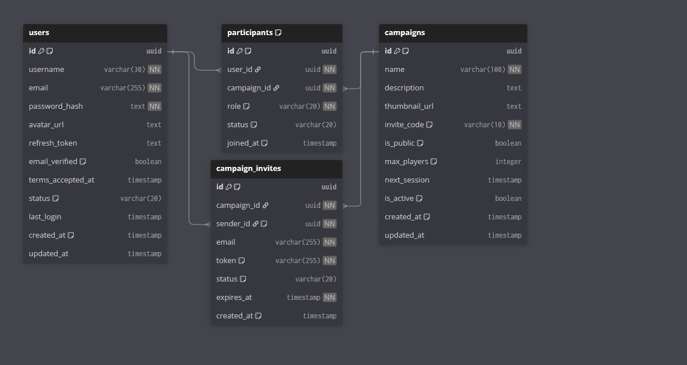

# 📊 DEV STATE — LegendForge

---

## 📅 Last Update

31/03/2026

---

## 🧱 Project Structure

```
LegendForge/
├── .vscode/
│   └── settings.json
│
├── dist/
│   └── index.js
│
├── docs/
│   ├── DEV_STATE.md
│   ├── ARCHITECTURE.md
│   ├── BOOT.md
│   ├── FEATURE_CAPSULE.md
│   └── DEVELOPER_CONFIG-UTILIZE.txt
│
├── src/
│   └── index.ts
│
├── .env
├── .env_explicação
├── .gitignore
├── .npmrc
├── eslint.config.js
├── package.json
├── tsconfig.json
```

---

## ⚙️ Dependencies (Setup / Backend)

### 🧪 Development

- TypeScript — 5.9.3
- tsx — 4.21.0
- @types/node — 24.10.13

### 🧹 Lint & Format

- ESLint — 9.39.2
- eslint-config-prettier — 10.1.8
- eslint-plugin-simple-import-sort — 12.1.1
- Prettier — 3.8.1

---

## 🗄️ Database

- ❌ Ainda não configurado

---

## 🧩 Database Models

- ❌ Nenhum modelo definido

---

## 🌐 API Endpoints

- ❌ Nenhum endpoint definido

---

## ✅ Implemented Features

- ⚡ Fastify API inicial configurada
- 🧱 Base do backend pronta
- 🛠️ Ambiente de desenvolvimento funcional

---

## 🎯 Current Focus

Iniciar camada de dados e estrutura do sistema:

- Design de arquitetura de dados e interface (UI/UX):
- Modelagem visual no dbdiagram.io
- Prototipagem no Figma

## Telas



## 🚀 Next Steps

- [ ] continuar diagrama de entidades e relacionamentos (ERD)
- [ ] continuar protótipo das telas de Dashboard e Mesa Virtual
- [ ] (Pausado) Integração Prisma (Aguardando definição do design)

---

## 🧠 Architecture Notes

- Revisar possíveis erros no `tsconfig.json`
- Manter desenvolvimento incremental
- Evitar complexidade prematura
